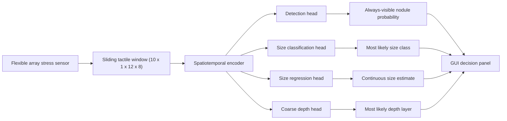

# Model And System Blueprint

## 1. Design Goal

The first formal paper system is defined as a real-time tactile inference pipeline with one primary output and three gated inversion outputs.

Its job is to:

1. receive a sliding tactile sequence
2. estimate whether a hidden nodule is present
3. estimate the most likely size
4. estimate a coarse depth layer
5. display the result in a stable real-time interface

## 2. Locked First-Version Input

The formal input is:

- a sliding window of `T = 10` consecutive frames
- each frame is a `12 x 8` tactile stress map
- tensor shape `R^(10 x 1 x 12 x 8)`

This is the only first-version official input contract.

## 3. Locked First-Version Outputs

The formal output set has 4 targets.

### 3.1 Primary Output

- `y_det_prob`
- nodule presence probability

### 3.2 Main Inversion Outputs

- `y_size_cls`
- `y_size_reg`

These support both categorical interpretation and continuous size estimation.

### 3.3 Secondary Output

- `y_depth_cls_coarse`

Coarse depth groups:

- `shallow = {0.5, 1.0}`
- `middle = {1.5, 2.0}`
- `deep = {2.5, 3.0}`

`7`-class depth is not part of the first formal output contract.

## 4. Recommended Pipeline

## 5. Training Roadmap

### Phase A: Detection First

Train:

- encoder + detection head

Goal:

- obtain a stable and credible detection model

### Phase B: Positive-Condition Inversion

Train:

- size classification
- size regression
- coarse depth classification

Using:

- positive windows
- or detection-gated positive windows

Goal:

- learn inversion behavior on meaningful samples only

### Phase C: Optional Joint Fine-Tuning

Only after Phase A and B are stable:

- jointly fine-tune detection + size + depth

This is an optional refinement stage, not the first formal training mode.

## 6. Loss Blueprint

Recommended first-version target combination:

`L_total = L_det + lambda_size_cls * M_pos * L_size_cls + lambda_size_reg * M_pos * L_size_reg + lambda_depth * M_pos * L_depth_coarse`

Where:

- `M_pos = 1` only for positive or gated positive windows
- detection remains the unmasked primary loss

Recommended loss family:

- detection:
  - `BCEWithLogitsLoss(pos_weight)` first
- size classification:
  - cross-entropy
- size regression:
  - `L1` or `SmoothL1`
- coarse depth:
  - cross-entropy

## 7. Evaluation Blueprint

### Detection

- AUC
- AP
- F1
- sensitivity
- specificity

### Size

- size classification:
  - top-1 accuracy
  - top-2 accuracy
  - confusion matrix
- size regression:
  - MAE
  - median absolute error

### Depth

- 3-class coarse depth accuracy
- top-2 accuracy if needed
- confusion matrix
- interpretation consistency with the non-model depth mechanism analysis

## 8. GUI Contract

The GUI first version should follow a gated display rule:

- always show detection probability
- only show size and depth when `p_det` exceeds the operating threshold

Displayed fields:

- `结节概率`
- `最可能大小`
- `大小连续估计值`
- `最可能深度层级`

This prevents unstable size/depth outputs from appearing when the model is not yet confident that a nodule is present.

## 9. Claim Boundary

The first paper version should claim:

- strong detection
- stable size inversion
- coarse depth training with mechanism support

It should not claim:

- stable fine-grained 6-class depth inversion
- universal linear depth attenuation
